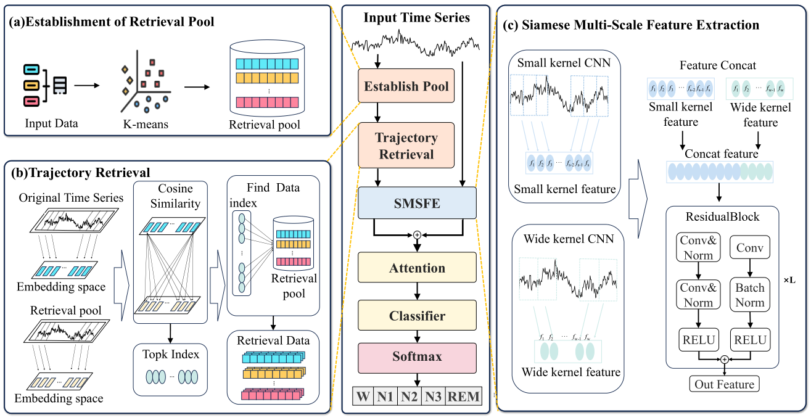

# TRA: rajectory Retrieval Augmented Model for Automatic Sleep Staging

This repository contains the implementation of TRA-Net, a retrieval augmented architecture for sleep stage classification using the Sleep-EDF-20 dataset.

## Model Architecture

The model architecture is based on retrieval augmented architecture for sleep stage classification. The detailed model diagram can be found in `TRA.pdf`.



## Dataset

### Sleep-EDF-20 Dataset

The Sleep-EDF-20 dataset contains 20 subjects' polysomnography (PSG) recordings with sleep stage annotations. Each recording includes EEG signals and corresponding hypnogram annotations.

### Dataset Download

To download the Sleep-EDF-20 dataset:

```bash
cd prepare_datasets
bash download_edf20.sh
```

This script will download all the necessary EDF files and hypnogram annotations from PhysioNet.

### Data Preprocessing

After downloading the dataset, preprocess the data to convert EDF files to numpy format:

```bash
python prepare_datasets/prepare_physionet.py --data_dir data_edf_20 --output_dir data/data-sleep-EDF-20-npz --select_ch "EEG Fpz-Cz"
```

## Environment Setup

### Requirements

Install the required dependencies:

```bash
pip install -r requirements.txt
```

Key dependencies include:
- PyTorch
- TensorFlow
- MNE (for EEG data processing)
- NumPy, SciPy, scikit-learn
- h5py (for HDF5 file handling)

### Hardware Requirements

- GPU with CUDA support recommended
- At least 16GB RAM for training
- Sufficient storage space for dataset (~10GB)

## Usage

### Training a Single Fold

To train on a specific fold (0-19):

```bash
python train_Kfold_CV.py --fold_id=0 --device 0 --np_data_dir data/data-sleep-EDF-20-npz
```

Parameters:
- `--fold_id`: The fold number to train (0-19)
- `--device`: GPU device ID (0 for first GPU)
- `--np_data_dir`: Directory containing preprocessed numpy files

### Training All 20 Folds

To train all 20 folds sequentially:

```bash
bash train_20_fold.sh 0 data/data-sleep-EDF-20-npz
```

Parameters:
- First argument: GPU device ID
- Second argument: Data directory

The script will automatically train folds 0 through 19.

## Configuration

The training configuration is specified in `config.json`:

```json
{
    "name": "Exp1",
    "n_gpu": 1,
    "arch": {
        "type": "TRA_Net",
        "args": {}
    },
    "data_loader": {
        "args": {
            "batch_size": 128,
            "num_folds": 20
        }
    },
    "optimizer": {
        "type": "Adam",
        "args": {
            "lr": 0.001,
            "weight_decay": 0.001,
            "amsgrad": true
        }
    },
    "loss": "weighted_CrossEntropyLoss",
    "metrics": ["accuracy"],
    "trainer": {
        "epochs": 60,
        "save_dir": "saved",
        "save_period": 30,
        "verbosity": 2,
        "monitor": "min val_loss"
    }
}
```

## Project Structure

```
.
├── base/                    # Base classes
├── data/                    # Data directories
│   ├── data-sleep-EDF-20-h5/    # HDF5 formatted data
│   └── data-sleep-EDF-20-npz/   # NPZ formatted data
├── data_loader/             # Data loading modules
├── logger/                  # Logging utilities
├── model/                   # Model definitions
│   ├── loss.py             # Loss functions
│   ├── metric.py           # Evaluation metrics
│   ├── model.py            # Main model architecture
│   └── model_retrieval.py  # Retrieval model
├── prepare_datasets/        # Dataset preparation scripts
├── saved_lr=0.05/          # Saved models
├── trainer/                # Training modules
├── utils/                  # Utility functions
├── config.json            # Configuration file
├── parse_config.py       # Configuration parser
├── requirements.txt      # Python dependencies
├── train_20_fold.sh      # 20-fold training script
├── train_Kfold_CV.py     # Cross-validation training
└── TRA.pdf              # Model architecture diagram
```

## Training Details

- **Epochs**: 60 per fold
- **Batch Size**: 128
- **Optimizer**: Adam with learning rate 0.001
- **Loss Function**: Weighted Cross Entropy Loss
- **Validation**: 20-fold cross validation
- **Metrics**: Accuracy

## Results

Model checkpoints and training logs are saved in the `saved` directory. Each fold's results are stored in separate subdirectories.

## Troubleshooting

### Common Issues

1. **Dataset Download Issues**: 
   - Ensure you have a stable internet connection
   - Check if PhysioNet requires registration for dataset access

2. **Memory Issues**:
   - Reduce batch size in config.json if encountering OOM errors
   - Use data augmentation techniques to work with smaller batches

3. **CUDA Out of Memory**:
   - Try using a smaller batch size
   - Use mixed precision training if supported by your GPU

4. **Dependency Conflicts**:
   - Use a virtual environment to isolate dependencies
   - Check PyTorch and CUDA version compatibility

## Contributing

Contributions are welcome! Please feel free to submit a Pull Request.

## Contact

For questions about this implementation, please open an issue on GitHub.

## Acknowledgments

- Sleep-EDF dataset provided by PhysioNet
- MNE-Python team for EEG data processing tools
